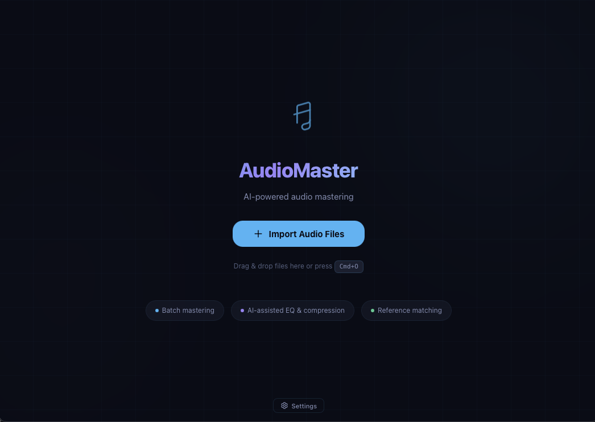

# AudioMaster

[](https://www.gnu.org/licenses/gpl-3.0)
[](https://github.com/KEYHAN-A/AudioMaster)
[](https://github.com/KEYHAN-A/AudioMaster/releases)
[]()
[](https://audiomaster.keyhan.info)
[](https://github.com/KEYHAN-A/AudioMaster/actions/workflows/ci.yml)

AI-powered music mastering with real-time visualizations, batch processing, and multiple AI backends. Built with **Rust** and **Tauri v2** for native performance.

**Free and open source.** [Website](https://audiomaster.keyhan.info) | [Download](https://github.com/KEYHAN-A/AudioMaster/releases) | [Report Issue](https://github.com/KEYHAN-A/AudioMaster/issues)

---



---

## What It Does

You have a track — or an entire album — that needs mastering. AudioMaster analyzes your audio (LUFS, dynamic range, stereo width, frequency balance), sends the analysis to an AI backend or Matchering engine, applies the recommended processing, and exports a mastered file. Batch-process a full album in one click.

### Key Features

- **AI-powered mastering** — Ollama (local), OpenAI, Anthropic, or KeyhanStudio backends
- **Reference-based mastering** — Matchering matches loudness, EQ, and dynamics to any reference track
- **Real-time visualizations** — Waveform, LUFS meters, 7-band spectrum analyzer with before/after
- **Batch processing** — Import multiple tracks, Analyze All, Master All
- **Configurable presets** — Streaming (-14 LUFS), CD (-9), Vinyl (-12), Loud (-6)
- **Native audio analysis** — LUFS, RMS, Peak, True Peak, Dynamic Range, Stereo Width, Frequency Bands
- **CLI tool** — Full command-line interface for scripting and automation
- **Cloud save** — Save presets to the cloud via Keyhan Studio account (optional)
- **Cross-platform** — macOS (Windows and Linux coming soon)

---

## Two Ways to Use AudioMaster

### 1. Desktop App (Tauri v2 + Vue 3)

The full GUI experience with glassmorphism UI, drag-and-drop, and real-time visualizations.

```bash
# Build and run
npm install
npx tauri dev
```

**Features:** Glassmorphism dark UI, waveform canvas, LUFS meter bars, spectrum analyzer, batch track list, before/after comparison, configurable presets, settings dialog, drag-and-drop import.

### 2. Rust CLI

Headless command-line tool for servers, pipelines, and automation.

```bash
# Build the CLI
cargo build --release -p mastering-cli

# Analyze a file
./target/release/mastering analyze input.wav

# Master with default settings
./target/release/mastering master input.wav -o output.wav

# Master with a reference track
./target/release/mastering master input.wav -o output.wav --reference ref.wav

# Use a specific backend
./target/release/mastering master input.wav -o output.wav --backend matchering
```

**Flags:** `--backend` (matchering/ai/local-ml), `--preset` (streaming/cd/vinyl/loud), `--reference`, `--target-lufs`, `--output`.

---

## Architecture

```
AudioMaster/
├── crates/
│   ├── mastering-core/      # Rust library — analysis, backends, pipeline
│   │   └── src/
│   │       ├── analysis/        # LUFS, RMS, Peak, Dynamic Range, Stereo Width, Frequency Bands
│   │       ├── backends/        # AI (Ollama/OpenAI/Anthropic/KeyhanStudio), Matchering, Local ML
│   │       ├── pipeline/        # Orchestration: analyze → decide → process → export
│   │       └── config.rs        # TOML configuration management
│   └── mastering-cli/       # Rust CLI binary
│       └── src/main.rs          # Clap-based CLI with analyze/master/config commands
├── src-tauri/               # Tauri v2 desktop app (Rust backend)
│   └── src/
│       ├── commands.rs          # IPC bridge (8 commands)
│       └── lib.rs               # App entry, plugins, state
├── src/                     # Vue 3 frontend
│   ├── composables/
│   │   └── useMastering.js      # Central state + Tauri invoke wrappers
│   └── components/
│       ├── MainLayout.vue       # App shell, toolbar, empty state, status bar
│       ├── TrackList.vue        # Horizontal batch track list
│       ├── WaveformCanvas.vue   # Canvas waveform + LUFS meters + spectrum analyzer
│       ├── AnalysisPanel.vue    # Detailed metrics with before/after
│       ├── MasteringDialog.vue  # Backend/preset selection
│       ├── SettingsDialog.vue   # Configuration editor
│       ├── ProcessingDialog.vue # Progress indicator
│       └── ToastNotification.vue
├── python/                  # Python backends (Matchering, Pedalboard, ML)
├── website/                 # Marketing website (audiomaster.keyhan.info)
├── .github/workflows/       # CI + Release + Deploy pipelines
├── Cargo.toml               # Rust workspace
└── package.json             # Node.js (Vue + Vite)
```

---

## Audio Analysis

AudioMaster measures 7 metrics natively in Rust:

| Metric | Description |
|--------|-------------|
| Integrated LUFS | Overall perceived loudness (EBU R128) |
| Short-Term LUFS | Maximum loudness in a 3-second window |
| RMS | Root mean square level |
| Peak / True Peak | Sample peak and inter-sample peak |
| Dynamic Range | Difference between loud and quiet sections |
| Stereo Width | Spatial characteristics (mono → wide) |
| Frequency Bands | 7-band analysis (sub-bass through brilliance) |

All metrics are computed before and after mastering for comparison in the visualizer.

---

## Mastering Backends

| Backend | Type | Description |
|---------|------|-------------|
| Matchering | Reference-based | Matches loudness, EQ, and dynamics to a reference track |
| Ollama | AI (local) | Local LLM generates mastering parameters from analysis |
| OpenAI | AI (cloud) | GPT-4 generates mastering parameters |
| Anthropic | AI (cloud) | Claude generates mastering parameters |
| KeyhanStudio | AI (gateway) | Central AI gateway with multiple model access |
| Local ML | ML (local) | Local machine learning inference |

---

## Development

### Prerequisites

- **Rust** (stable) — `curl --proto '=https' --tlsv1.2 -sSf https://sh.rustup.rs | sh`
- **Node.js** 18+ — `brew install node` or [nodejs.org](https://nodejs.org)
- **Python** 3.8+ — for Matchering and effects backends
- **ffmpeg** — `brew install ffmpeg` (required for format conversion)

### Build

```bash
# Install frontend dependencies
npm install

# Install Python backends
pip install -r python/requirements.txt

# Run tests
cargo test --workspace

# Development mode (hot-reload)
npx tauri dev

# Production build
npx tauri build

# CLI only (no GUI dependencies)
cargo build --release -p mastering-cli
```

### Test

```bash
# All Rust tests
cargo test --workspace

# Core library only
cargo test -p mastering-core

# CLI only
cargo test -p mastering-cli
```

### Configuration

Copy the example config and edit to taste:

```bash
cp config.toml.example ~/.config/mastering/config.toml
```

---

## Feature Comparison

| Feature | Desktop App | Rust CLI |
|---------|:-----------:|:--------:|
| AI mastering | Yes | Yes |
| Reference mastering (Matchering) | Yes | Yes |
| Batch processing | Yes | Yes |
| LUFS / RMS / Peak analysis | Yes | Yes |
| Waveform visualization | Yes | -- |
| LUFS meter bars | Yes | -- |
| Spectrum analyzer | Yes | -- |
| Before/after comparison | Yes | Yes |
| Configurable presets | Yes | Yes |
| Drag-and-drop | Yes | -- |
| Cloud presets | Yes | -- |
| Headless/server use | -- | Yes |
| GUI | Tauri + Vue 3 | -- |

---

## License

GPL-3.0 — see [LICENSE](LICENSE).

Created by [Keyhan](https://github.com/KEYHAN-A).
